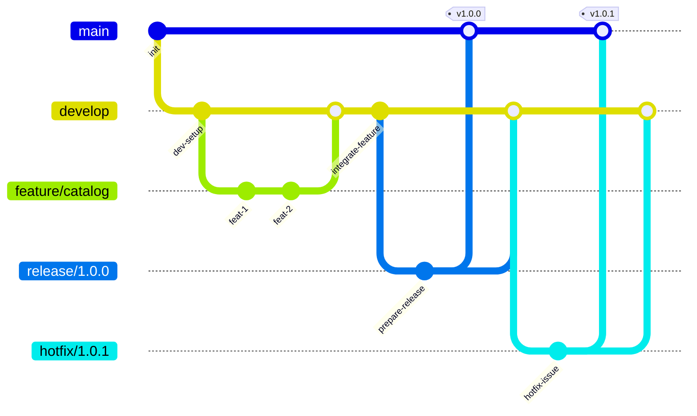

# PocketLists

## Descripción general

Listas simples y rápidas para la vida real. Crea y gestiona listas de compras, checklists de viaje y notas rápidas — todo sincronizado de forma fluida.

## Alcance y objetivos

- Resolver un flujo completo SSR + API para listas (servidor + cliente).
- Integrar validación, mocks de servicios externos y contratos de datos estables.
- Mantener modularidad (servicios, hooks, componentes) y estándares consistentes.

## Estados de la UI

- Carga: muestra un indicador de estado de carga con la etiqueta "Cargando listas..." mientras se obtienen los datos del cliente.
- Vacío: muestra un mensaje informativo cuando la lista de listas está vacía.
- Error: muestra un mensaje seguro y orientado a la acción cuando falla la obtención de datos SSR o del cliente, incluyendo errores de validación para parámetros de consulta inválidos.

## Plan

### Enfoque de alto nivel

- **Descubrimiento y contrato**: alinear el alcance del endpoint y la forma del dato para que server y UI trabajen con un contrato estable.
- **Backend solo servidor**: resolver la integración mediante servicios y mocks, con validaciones centrales y observabilidad segura.
- **SSR + cliente**: entregar SSR estable y permitir refresco de datos en cliente sin duplicar solicitudes.
- **Interfaz accesible**: construir la vista con estados claros y priorizando semántica y accesibilidad.
- **Diseño responsivo**: aplicar estilos modulares con enfoque mobile-first.
- **Calidad y pruebas**: cubrir con pruebas unitarias y asegurar calidad por linting, accesibilidad y reportes.

### Entregables

- Endpoint de listas listo para SSR y consumo cliente.
- Servicio de listas con mocks y normalización consistente.
- Página SSR con UI de resultados y estados controlados.
- Componentes con estilos modulares y diseño responsivo.
- Pruebas y checks de calidad integrados.

### Patrones de código

- Nomenclatura semántica: nombres descriptivos para variables, funciones, componentes y archivos.
- Retornos tempranos: manejar casos inválidos al inicio y evitar anidamientos profundos.
- Manejo de errores centralizado: concentrar la lógica en handlers/servicios y devolver respuestas consistentes.

### Políticas de CI y calidad

- El merge se bloquea si fallan lint (`npm run lint`), tests (`npm run test`) o build (`npm run build`).
- Todo cambio debe traer tests cuando aplique (ver `tests/`) y pasar localmente antes del PR.
- La calidad se asegura con los checks anteriores y el seguimiento de las guías de contribución.

### Convención de commits y ramas (opcional)

- Ramas con prefijos `feature/` y `fix/`, en minúsculas y con guiones (ver la sección "Guía de codificación").
- Commits siguiendo las 7 reglas de mensajes de commit (ver la sección "Guía de codificación").

## Documentación arquitectónica y decisiones (ADR)

- Registrar decisiones importantes bajo `docs/` con ADRs numerados (ej: `ADR-001`, `ADR-002`).
- Cada ADR debe incluir contexto, decisión, alternativas consideradas y consecuencias.
- Usar ADRs para definir estándares de cambios futuros y asegurar trazabilidad.

## Seguridad y manejo de datos sensibles

- Los secretos se gestionan con el gestor de secretos de la organización y nunca se versionan en el repositorio.
- No se deben almacenar ni loguear datos sensibles: información personal, tokens, credenciales, cookies o payloads con PII.

## Pruebas y cobertura

- Estrategia: unitarias (componentes, utils, servicios), integración (API + servicios con mocks) y E2E (flujos completos con WebdriverIO).
- Cobertura mínima: 80% en statements, branches, functions y lines, reportada por Jest en `coverage/`.
- Scripts: `npm run test:unit`, `npm run test:e2e`, `npm run test:a11y`, `npm run test` (todos), `npm run lint` y `npm run build` para validaciones automáticas.
- Accesibilidad: `npm run test:a11y` ejecuta axe-core sobre vistas clave para cumplir WCAG.
- Visual: snapshots en tests unitarios para detectar regresiones de UI.

## Anexos y utilitarios

- Plantillas: ADR, changelog y release notes con estructura mínima para mantener trazabilidad.
- Scripts automatizados (pseudocódigo): smoke tests y verificación de despliegue.
- Uso recomendado:
  - Antes de merge: completar ADR si hay decisión relevante y actualizar CHANGELOG si aplica.
  - Antes de release: generar RELEASE_NOTES desde CHANGELOG.
- Post-despliegue: ejecutar smoke tests y verificación de despliegue.

Plantilla ADR (mínima):

```
ADR-XXX: Título
Fecha: YYYY-MM-DD
Estado: Propuesto | Aceptado | Rechazado | Reemplazado

Contexto:
- Qué problema se resuelve y por qué ahora.

Decisión:
- Qué se decide y alcance.

Alternativas:
- Opciones evaluadas y por qué se descartan.

Consecuencias:
- Impacto técnico y operativo.
```

Plantilla CHANGELOG (mínima):

```
## [Sin publicar]
- Agregado:
- Cambiado:
- Corregido:

## [X.Y.Z] - YYYY-MM-DD
- Agregado:
- Cambiado:
- Corregido:
```

Plantilla RELEASE_NOTES (mínima):

```
# Lanzamiento X.Y.Z - YYYY-MM-DD

Destacados:
- Cambio principal.

Cambios:
- Agregado:
- Cambiado:
- Corregido:

Problemas conocidos:
- Lista corta si aplica.

Reversión:
- Pasos resumidos o referencia al runbook.
```

Scripts en pseudocódigo

```
smoke_test:
  http_get "/" => assert status 200
  http_get "/api/products?siteId=MLA&limit=1" => assert status 200
  assert response.items length >= 0

deploy_verification:
  assert last_deploy == expected_version
  assert error_rate_5xx <= 2% for 15m
  assert latency_p95 <= baseline * 1.2
  assert feature_flags == expected_state
```

## Primeros pasos

Primero, ejecuta el servidor de desarrollo:

```bash
npm run dev
# or
yarn dev
# or
pnpm dev
# or
bun dev
```

Abre [http://localhost:3000](http://localhost:3000) en tu navegador para ver el resultado.

Puedes empezar a editar la página modificando `app/page.tsx`. La página se actualiza automáticamente a medida que editas el archivo.

Este proyecto usa [`next/font`](https://nextjs.org/docs/app/building-your-application/optimizing/fonts) para optimizar y cargar automáticamente [Geist](https://vercel.com/font), una nueva familia tipográfica de Vercel.

## Más información

Para saber más sobre Next.js, revisa los siguientes recursos:

- [Documentación de Next.js](https://nextjs.org/docs) - conoce las funciones y la API de Next.js.
- [Aprende Next.js](https://nextjs.org/learn) - un tutorial interactivo de Next.js.

Puedes visitar [el repositorio de Next.js en GitHub](https://github.com/vercel/next.js) - ¡tus comentarios y contribuciones son bienvenidos!

## Despliegue en Vercel

La forma más sencilla de desplegar tu aplicación de Next.js es usar la [plataforma de Vercel](https://vercel.com/new?utm_medium=default-template&filter=next.js&utm_source=create-next-app&utm_campaign=create-next-app-readme) de los creadores de Next.js.

Consulta nuestra [documentación de despliegue de Next.js](https://nextjs.org/docs/app/building-your-application/deploying) para más detalles.

## Guia de codificacion

Se fomentan las contribuciones a este proyecto porque sabemos que distintos desarrolladores enriquecen nuestras codebases :punch:.

Sin embargo, absorber todas las contribuciones tal cual podria generar dificultades en el mantenimiento del codebase si no se controlan. Los codebases colaborativos suelen establecer lineamientos para que las contribuciones se mantengan sostenibles en el tiempo.

El proposito de esta guia es establecer un estandar para las contribuciones. Estas guias no buscan limitar las herramientas a tu disposicion ni reconfigurar tu forma de pensar, sino incentivar mejores practicas.

### Lineamientos de idioma

Usamos **Spanish** como lenguaje principal. El codigo fuente, comentarios, documentacion, mensajes de commit, comentarios de revision y cualquier otro tipo de contribucion deben escribirse en Spanish. Hacemos esto para ser consistentes en todo el proyecto y ser considerados con quienes no tienen el mismo idioma nativo.

### Lineamientos de comentarios :speech_balloon:

Los comentarios de codigo son dificiles de escribir, no porque sea dificil producir palabras sino porque es dificil escribir comentarios relevantes. Demasiados comentarios hacen que la gente no los lea (sin mencionar que dificultan la lectura del codigo). Muy pocos comentarios obligan a leer grandes porciones del codebase para entender que hace una feature o un bloque de codigo. Ambas situaciones son indeseables y siempre se deben hacer esfuerzos por tener una experiencia agradable al leer comentarios.

Como regla general, deberias comentar decisiones que tomaste mientras codificabas y que no forman parte de una especificacion.

En particular, siempre deberias comentar cualquier decision que:

- se aparte de la sabiduria comun o una convencion (el por que es necesario).
- haya tomado un tiempo significativo producirla. Una buena regla es: si pasaste mas de 1 hora pensando como producir un fragmento de codigo que tardaste 2 minutos en escribir, deberias documentar tu razonamiento para ayudar al lector y permitir validacion.
- necesite preservar propiedades de la implementacion. Este es el caso de porciones sensibles a performance, sincronizacion de corutinas, implementaciones de primitivas de seguridad, algoritmos de control de congestion, etc.

Como regla general de lo que no se debe comentar, evita:

- comentar la estructura de programas que ya forma parte de una convencion, especificada o no.
- explicaciones pedantes de comportamiento que pueden encontrarse con una lectura inmediata de los artefactos alrededor.
- comentar comportamientos que no puedes atestiguar.

### Lineamientos de branching :twisted_rightwards_arrows:

#### Seguir esta convencion de nombres:

- Para un patch que arregla un comportamiento no deseado por un bug, el nombre de la branch debe comenzar con `fix/`
- Para una nueva feature o un cambio en una feature existente, el nombre de la branch debe comenzar con `feature/`
- Luego de la categoria, el nombre debe tener como maximo tres palabras, en minusculas y separadas por guiones.
- Ejemplo: `feature/debounce`, `fix/question-box-height`
  > Para mas informacion, ver [gitflow](https://furydocs.io/release-process/latest/guide/#/lang-es/workflows/02_gitflow)

#### Diagrama GitFlow



Flujo: las features salen de `develop` y vuelven a `develop`; las releases salen de `develop` y se mergean a `main` y luego de vuelta a `develop`; los hotfix salen de `main` y se mergean a `main` y `develop`.

### Versionado

Adoptamos el sistema de versionado [semver](https://semver.org/): **MAJOR.MINOR.PATCH**

- MAJOR para cambios incompatibles con versiones anteriores
- MINOR para cambios compatibles que agregan nuevas features o mejoras
- PATCH para cambios compatibles, fixes o cambios minimos

### Lineamientos de CHANGELOG :page_facing_up:

En cada version de un proyecto recuerda **honrar** el lineamiento [Keep a CHANGELOG](https://keepachangelog.com/en):

1. Los changelogs son para humanos :busts_in_silhouette:, no para maquinas :robot:.
2. Debe haber una entrada para cada version.
3. Los mismos **tipos de cambios** deben agruparse.
4. Las versiones y secciones deben ser enlazables.
5. La version mas reciente va primero.
6. La fecha de release de cada version se muestra en el formato YYYY-MM-DD.

#### Tipos de cambio:

- `Added` para nuevas features.
- `Changed` para cambios en funcionalidad existente.
- `Deprecated` para lo que se eliminara pronto.
- `Removed` para lo eliminado actualmente.
- `Fixed` para fixes de bugs.
- `Security` en caso de vulnerabilidades.
